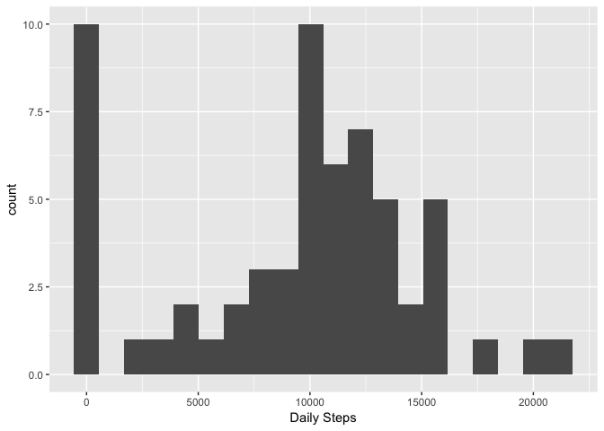
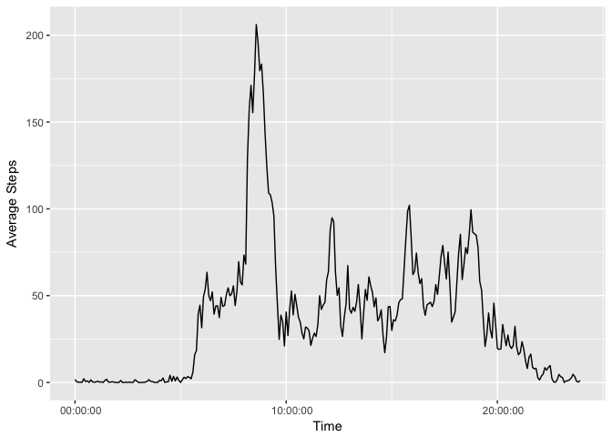
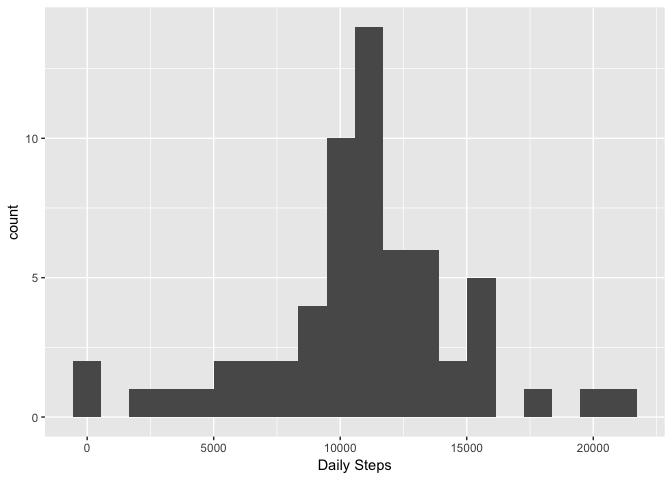
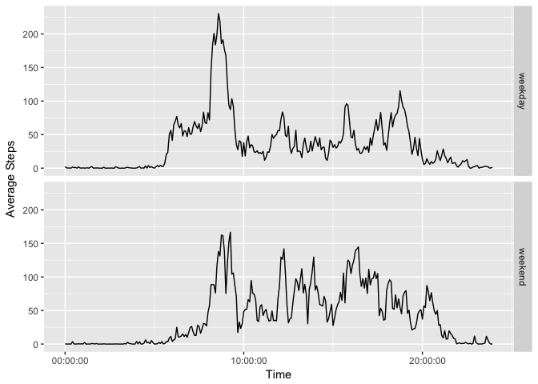

# Reproducible Research: Peer Assessment 1
<br>

## Load required libraries

```r
library(dplyr)
library(ggplot2)
library(lubridate)
```
<br>

## Loading and preprocessing the data

```r
unzip("./activity.zip")
activity <- read.csv("./activity.csv",colClasses = c("integer", "Date", "integer"))
```
<br>

## What is mean total number of steps taken per day?  
<br> 

#### First we group the data by date and sum the daily totals  

```r
stepsByDay <- activity %>% group_by(date) %>% summarise(stepsDay=sum(steps,na.rm = TRUE))
```
<br>

#### Then we can calculate the mean....

```r
mean(stepsByDay$stepsDay)
```

```
## [1] 9354.23
```
<br>

#### and the median....

```r
median(stepsByDay$stepsDay)
```

```
## [1] 10395
```
<br>

#### as well as plot a histogram showing Daily Steps


```r
ggplot(data=stepsByDay) + 
	geom_histogram(aes(stepsDay), bins = 20) + 
	labs(x = "Daily Steps")
```

<!-- -->
<br>
<br>

## What is the average daily activity pattern?
<br>

#### Here we generate a data frame showing the average number of steps for each interval across all days 

```r
stepsByInterval <- activity %>% group_by(interval) %>% summarise(intAvgSteps=mean(steps,na.rm = TRUE))
```
<br>

#### Then we need to convert the interval integer labels to time before plotting

```r
stepsByInterval$interval <- ymd_hm( paste("1970-01-01", 
				  format(strptime(sprintf("%04d", stepsByInterval$interval), format="%H%M"), format = "%H:%M")))
```
<br>

#### We can then plot the daily averages per time interval

```r
ggplot(data=stepsByInterval, aes(interval,intAvgSteps)) + 
	geom_line() + 
	scale_x_time() +
	labs(x = "Time", y = "Average Steps")
```

<!-- -->

#### Finally we find the daily time interval with the largest average number of steps

```r
maxint <- filter(stepsByInterval,intAvgSteps == (max(intAvgSteps)))
paste(paste(hour(maxint$interval),minute(maxint$interval),sep=":"), "with an average of", maxint$intAvgSteps, "steps per day")
```

```
## [1] "8:35 with an average of 206.169811320755 steps per day"
```
<br>
<br>

## Imputing missing values
<br>

#### Total percentage of missing values from steps column

```r
mean(is.na(activity$steps))
```

```
## [1] 0.1311475
```
<br>

#### We will fill missing values with the average value for that interval and create a new DF - activityNoNA


```r
intervalAvgs <- activity %>% group_by(interval) %>% summarise(AvgSteps=mean(steps,na.rm = TRUE))
names(intervalAvgs) <- c("inter","AvgSteps")
for(i in 1:nrow(activity)){
	row <- activity[i,]
	if(is.na(row$steps)) {row$steps <- filter(as.data.frame(intervalAvgs),inter==row$interval)[,2]}
	if(!exists("activityNoNA")){activityNoNA <<- data.frame(steps = integer(), date = as.Date(character()), interval = integer(), stringsAsFactors = FALSE)}
	
	newr <- data.frame(steps = row$steps, date = row$date, interval = row$interval, stringsAsFactors = FALSE)
	activityNoNA <<- rbind(activityNoNA,newr)
	}
```
<br>

#### First we group the non-NA data by date and sum the daily totals  

```r
stepsByDayNoNA <- activityNoNA %>% group_by(date) %>% summarise(stepsDay=sum(steps,na.rm = TRUE))
```
<br>

#### Then we can calculate the mean for the new dataset....

```r
mean(stepsByDayNoNA$stepsDay)
```

```
## [1] 10766.19
```
<br>

#### and the median....

```r
median(stepsByDayNoNA$stepsDay)
```

```
## [1] 10766.19
```
<br>

#### as well as plot a histogram showing Daily Steps


```r
ggplot(data=stepsByDayNoNA) + 
	geom_histogram(aes(stepsDay), bins = 20) + 
	labs(x = "Daily Steps")
```

<!-- -->
<br>
<br>

## Are there differences in activity patterns between weekdays and weekends?
<br>

#### We can use mutate to add a weekend factor to the data and then calcualte the means as before

```r
activityNoNA <- activityNoNA %>% 
mutate(dayOfWeek = as.factor(ifelse(wday(activityNoNA$date)==1 | wday(activityNoNA$date)==7,"weekend","weekday")))

stepsByIntervalNoNA <- activityNoNA %>% group_by(interval,dayOfWeek) %>% summarise(intAvgSteps=mean(steps))
stepsByIntervalNoNA$interval <- ymd_hm( paste("1970-01-01", 
				format(strptime(sprintf("%04d",stepsByIntervalNoNA$interval),format="%H%M"), format = "%H:%M")))
```
<br>

#### and then plot the weekend and weekdays separately to see the difference.


```r
ggplot(data=stepsByIntervalNoNA, aes(interval,intAvgSteps)) + 
	geom_line() + 
	scale_x_time() +
	labs(x = "Time", y = "Average Steps") +
	facet_grid(dayOfWeek ~ .)
```

<!-- -->


